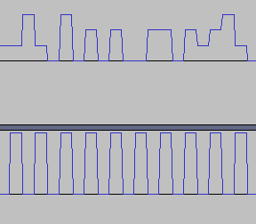

# Final Wave

We got an audio file.
We know that two persons are conversing.

The file opened with audacity allows us to observe a pattern.

we imagined that the pattern below represented the "tics", the high value of the graph below are the moment where there is a valuable information that can be retreived from the graph above.

We identified 4 levels of intensity in the graph above :

- 0
- 1/3
- 2/3
- 1

Since we know that two person are speaking, we imagined that we can assign two values for each level of intensity:

- 0 = `00`
- 1/3 = `10`
- 2/3 = `01`
- 1 = `11`

But, we have to compose two different binary sentences, one that concatenates every first bit and the other that concatenates every second bit.

Then we scripted the retreiving of these informations, convert the binary into ascii and found the flag.
