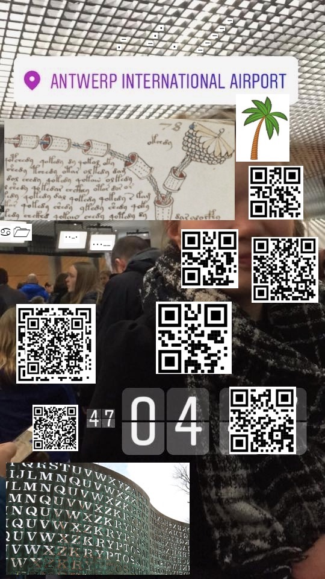

# The stolen cryptex

```txt
Gyqkj he znk zuv zcu atjkxiubkx gmktzy ul znk Sogso vuroik luxik (Yutte Ixuiqkzz gtj Xoiu Zahhy) zu gyyoyz znks ot xkyurbotm znk seyzkxouay znklz ul znk Rgyz Ixevzkd, eua mu zu znk ixosk yiktk
Kbkxeznotm ykksy zu ngbk bgtoynkj gz znk ruiay jkroizo, utre g ixevzoi tuzk cgy rklz.

Zs1Mg09DYsdTXLKdCBXPSq4eAs1UksduZrjgg056XDjVB0qdZ0XpkrvKAZXTXK5yCBXCgLrAXZBTBKK1ZqXCg1rwgfLTkrAdCDvFS1vwgM1ghAq1Z0XLSq5KXZXUB1FzZ0XTTK9NBsngXMduCqjYgBrzXZBFSrr6ZC1MgK5zBDjUXKAcCBXPj1vAgfXFB1AfZ0jBj01DCZXgB000CqjTS01KXszTB1K0ZtvghK1AAZBUBK16CC1Mgq5KgMzTkq0cZqjLkrvNZDnTSrvxZCvFSBrAZZBTXK01ZtvHTLvKYsrTXMT5ZDvMgK56FM1UXKFwZCvggK1NBDjgXMXvZrjXkA4eAZLUkqPzCBjPS05zAsnUksdyCrXYgA5NBZXUBK5uZZPFSK56gfTgXKvvCBjXTA1KWZHUhAr3ZpPXSK1wAsnTX0vvZ0XTTLrACZLVBKB3ZpPFTLvwE3vgXKL3CZPCgq1KCZLUX1KfCrjYgrrzZDvUkq5xCZPTj01NADjghA5yZ1XYhA5wXsnTB1r3Z0Xqg1vwCZTFSqFxZ0XMhA4eADrFBKvvZ0XCgA16Ef06YATQXCOeTM5qW0P3CBi1iLr5TMrPWZ09

Yosarzgtkuayre, gz znk inkiq-ot jkyq ul Sogso^Gtzckxv Otzkxtgzoutgr Goxvuxz g voizaxk cgy zgqkt ul znk suyz lgsuay ixevzu-znokbky, oz igt hk luatj gz nzzvy://mu.gcy/2bg7p1W

"Utk ul znkyk jgey" O corr rkgxt tuz zu ayk znuyk ckoxj, corj, lutzy cnkt iusvuyotm ingrrmkty
"Zcu vxotiky" cgy g yutm lxus znk 90'y, haz gryu xksotjy zngz grr iusky ot vgoxy
"Komnz jgey g ckkq" yu eua ngbk zu lotj zcu hezky vkx jge zu yurbk ot g ckkq
```

ceasar cipher 13

```txt
Asked by the top two undercover agents of the Miami police force (Sonny Crockett and Rico Tubbs) to assist them in resolving the mysterious theft of the Last Cryptex, you go to the crime scene
Everything seems to have vanished at the locus delicti, only a cryptic note was left.

Tm1Ga09XSmxNRFExWVRJMk4yUm1OemxoTldaa056RXdPV0kxT0RjelpEUTRNRE5sWVRWaFlURTVNVEE1TkRWa1lqazFNelUxWXpZM1pqaG1abUk1T0RFMk5ERTROV1ZtT0RNNE9HVmhaRGxoWkdSaVltRTVZMll6TW1GaE5tVXdOREUwWVRJd1pUazRZV1UzT0dVd01XWTRaV000WkdNM01ERmtNV1E0TnpabE1UUTVOVE16WW1Gak5EaGtNek0wTkdFelpHTXhNMlprTWpZMVlUTTVNRE01TnpBNFpESmlNRGN5TXpGaE56ZG1OREZqTWpaaE1HVXdaRGRpTldReU4yUTFOekJtWVdJM05tUmhOemxsWlRSaU5HVTROVE5oTTJZME56azNaREppWVdRNU1EQTBObUl3TjJRME1qUmhNR0ppT0RNNFlUWTFPVEV3TjJZNFpqY3paREF3WTJWak1EWTFOR1EzWldSalltTXpOek5rWTJNd01HUXdabU5sT1RSbU5qRmhNV1l3T0Rka1pqWTNZMkZrT0RGbU4yUXlZVEppT0RWaU16Yz06SUNKRWIyNG5kQ0J3WVc1cFl5NGlJQT09

Simultaneously, at the check-in desk of Miami^Antwerp International Airport a picture was taken of the most famous crypto-thieves, it can be found at https://go.aws/2va7j1Q

"One of these days" I will learn not to use those weird, wild, fonts when composing challgens
"Two princes" was a song from the 90's, but also reminds that all comes in pairs
"Eight days a week" so you have to find two bytes per day to solve in a week
```

## Image

The [link](https://s3-eu-west-1.amazonaws.com/be.cscbe.challenges.2020/The+stolen+cryptex_28fb8b2e821159469bd0c03a4c81e1f8/IMG_0273.jpeg) leads to an image with plenty of qrcode and stuf



A look in the metadata of the file give us this clue :

```txt
48 40 6C 46 20 4B 33 79 (the other half of the key is not here)
```

Then we had to analyse the image.
There is a log of garbage link on the image but here's what I found interesting:

```txt
Voynich Manuscript

https://www.vox.com/2015/8/25/9200801/wingdings-font-history

No need to solve the Beale papers, a part of the key is: 3E BB
```

solved parts :

- `ad e0` (morse)
  <!-- - `78` (manuscript image) -->
- `a1` (icons)
- `f3` (morse)
- `3e bb` (qrcode)
- `47 04` (image)
- `0c 07 15 1a 0c` (miami ^ Antwerpen)
- `??` (numbers)

## Base 64

the 'mysterious text' seems to be some kind of base64

```txt
NmFkOWJlMDQ1YTI2N2RmNzlhNWZkNzEwOWI1ODczZDQ4MDNlYTVhYTE5MTA5NDVkYjk1MzU1YzY3ZjhmZmI5ODE2NDE4NWVmODM4OGVhZDlhZGRiYmE5Y2YzMmFhNmUwNDE0YTIwZTk4YWU3OGUwMWY4ZWM4ZGM3MDFkMWQ4NzZlMTQ5NTMzYmFjNDhkMzM0NGEzZGMxM2ZkMjY1YTM5MDM5NzA4ZDJiMDcyMzFhNzdmNDFjMjZhMGUwZDdiNWQyN2Q1NzBmYWI3NmRhNzllZTRiNGU4NTNhM2Y0Nzk3ZDJiYWQ5MDA0NmIwN2Q0MjRhMGJiODM4YTY1OTEwN2Y4ZjczZDAwY2VjMDY1NGQ3ZWRjYmMzNzNkY2MwMGQwZmNlOTRmNjFhMWYwODdkZjY3Y2FkODFmN2QyYTJiODViMzc=:ICJEb24ndCBwYW5pYy4iIA==
```

which can be separated in two :

```txt
6ad9be045a267df79a5fd7109b5873d4803ea5aa1910945db95355c67f8ffb98164185ef8388ead9addbba9cf32aa6e0414a20e98ae78e01f8ec8dc701d1d876e149533bac48d3344a3dc13fd265a39039708d2b07231a77f41c26a0e0d7b5d27d570fab76da79ee4b4e853a3f4797d2bad90046b07d424a0bb838a659107f8f73d00cec0654d7edcbc373dcc00d0fce94f61a1f087df67cad81f7d2a2b85b37
```

and

```txt
 "Don't panic."
```

hex_decode :

```txt
jÙ¾Z&}÷_×sÔ>¥ª]¹SUÆû
ïêÙ­Ûºó*¦àAJ éçøìÇÑØváIS;¬HÓ4J=Á?Òe£+#wô& à×µÒ}W«vÚyîKN
:?GÒºÙF°}BJ
           ¸8¦YsÐ
Î}ö|­÷Ò¢¸[7      ìT×íËÃsÜÀ
```

base64 decode :

```txt
�}m�8孺�����_w�t��|�wx�M�k����t��]o�w�:��}�|׮5��<y�}i�[m�\}�k���^�G����5ǜ��;�Wuw��{^=�}�i�<w}���s]�wn�kt����ݛӽ�ծ��\ۦ�{G{o�v��{����Z�מ�����;��vm�}�N:oN��nѶ��ƺ��t���wt�ǜӮxw��q�7�w\sM�����խ_�����i�5�vkf���
```
